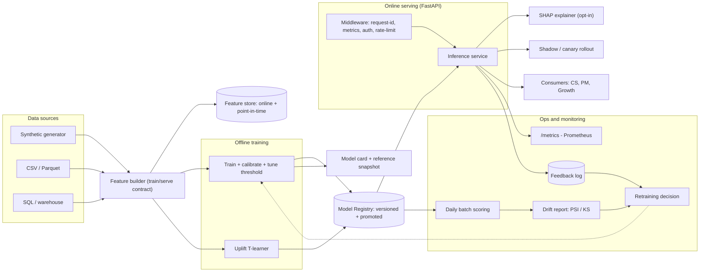
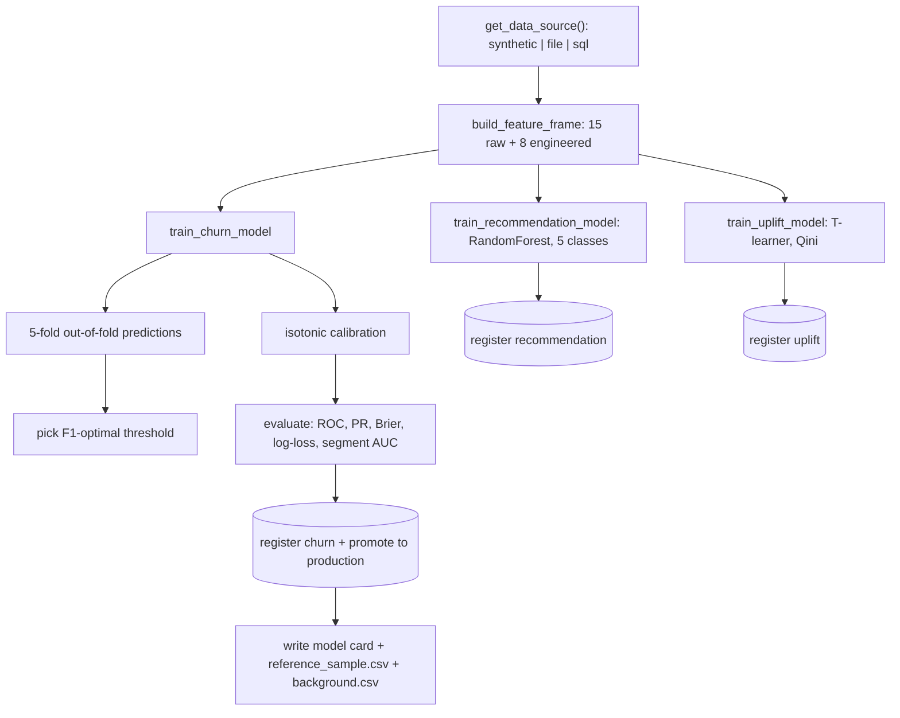
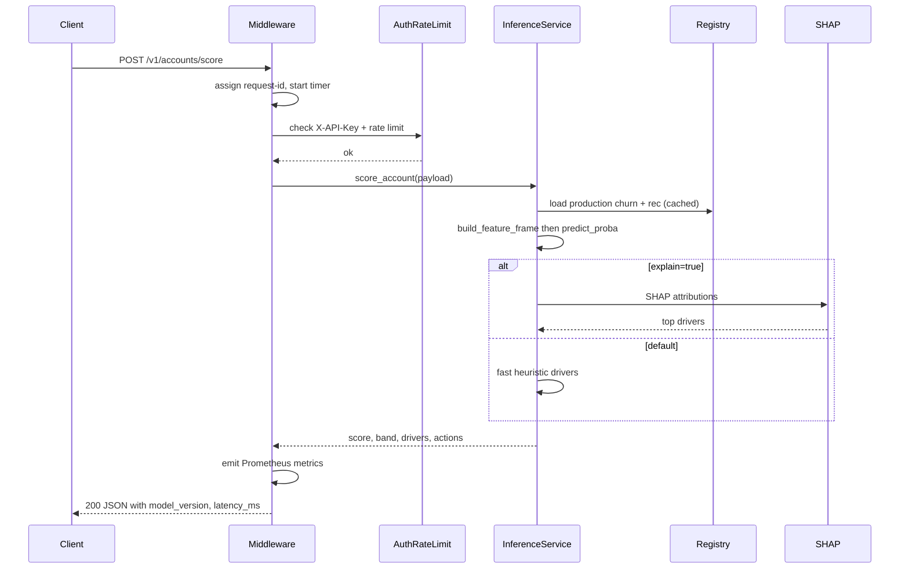
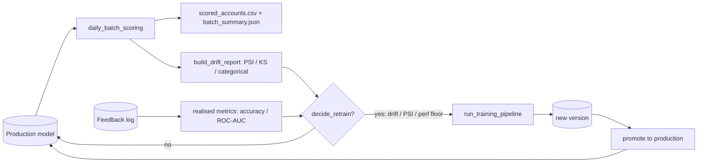
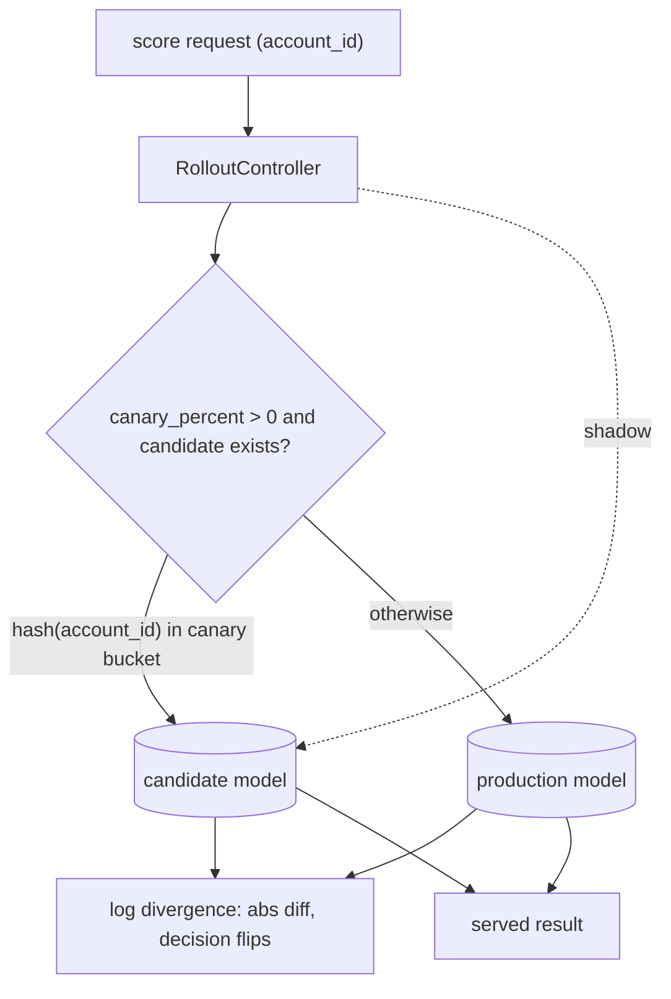

# Pulse360 — Product Intelligence Platform

An end-to-end, production-shaped AI/ML platform that turns raw B2B SaaS product
telemetry into decisions: **calibrated churn risk**, **next-best-feature
recommendations**, **account copilot summaries**, and **model-informed roadmap
prioritization** — served behind an observable, secured FastAPI service with a
model registry, drift monitoring, and CI.

It is built the way a senior AI/ML engineer ships ML into a product: a stable
training/serving feature contract, calibrated and threshold-tuned models,
per-prediction explainability, versioned artifacts, and operational telemetry —
not just a notebook that fits a model.

---

## Why this is improved

| Area | What it demonstrates |
|---|---|
| **Calibrated probabilities** | `CalibratedClassifierCV` (isotonic) + Brier score + reliability curve — actions key off probabilities, so they must be trustworthy. |
| **Decision-threshold optimization** | Operating point chosen to maximize F1 on **out-of-fold** predictions (no leakage). On a sample run this lifts F1 by **+0.14** (0.37 → 0.52). |
| **Explainability** | SHAP per-account risk drivers (opt-in), with a deterministic fallback. Kept **off the hot path** so default scoring stays in single-digit ms. |
| **Training/serving parity** | One `build_feature_frame` used by both offline training and online inference — no skew. |
| **Model registry** | Immutable, content-addressed versions, a JSON index, and stage promotion. Every response carries its `model_version`. |
| **Monitoring & retraining** | PSI / KS / categorical drift → severity report → auditable retraining decision. |
| **Observability** | Prometheus `/metrics`, structured JSON logs, request-id correlation, latency histograms. |
| **Production API** | Config-gated API-key auth, rate limiting, readiness probes, typed responses, error envelopes, CORS. |
| **Engineering quality** | `ruff` + `ruff-format` + `mypy` + `pytest` (47 tests) + GitHub Actions matrix CI + pre-commit + Docker. |

---

## Architecture

End-to-end component and data flow: offline training produces immutable, promoted
model versions in the registry; the online FastAPI service loads the *production*
versions and turns raw account payloads into decisions; an ops loop scores
batches, watches drift, ingests feedback, and gates retraining.



---

## Workflows & pipelines

### Offline training pipeline

`run_training_pipeline` loads data through the pluggable source, builds the shared
feature frame, then trains three models. The churn model is calibrated (isotonic)
and its decision threshold is picked from **out-of-fold** predictions to avoid
test leakage. All three are registered as immutable versions and the production
pointer is advanced; a model card and a drift reference snapshot are written.



### Online inference request flow

Every request gets a correlation id and is timed; auth and rate-limiting are
config-gated. Scoring is fast by default (heuristic drivers); SHAP is opt-in.
Prometheus metrics and the request-id are emitted on the way out.



### MLOps lifecycle & retraining loop

The daily batch job scores a fresh snapshot and compares it to the training
reference; realised outcomes from the feedback log add a performance signal.
`decide_retrain` turns drift + performance into an auditable yes/no. Rollback is
a registry re-point, not a redeploy.



### Shadow + canary rollout

A candidate version (registry stage) can be scored in **shadow** alongside
production (divergence logged) and ramped via **canary** routing — a stable
fraction of accounts, chosen by deterministic hash, served by the candidate.



---

## Capabilities

| Capability | Purpose | Consumers |
|---|---|---|
| Churn model | Calibrated account churn risk + drivers | CS, lifecycle, PM |
| Feature recommender | Best next capability to promote | Growth, sales, PM |
| Copilot summary | Signals -> narrative action plan | CS, PM, leadership |
| Roadmap prioritizer | Rank initiatives (RICE + strategy + modeled uplift) | Product |
| Uplift model | Incremental effect of a save-play (who is *persuadable*) | CS, lifecycle |
| Monitoring | Drift, retraining triggers, service health | MLE, DS, platform |

---

## Quick start

```bash
# 1) Install (with explainability + dev tooling)
pip install -e ".[dev,explain]"

# 2) Train + register the production models (writes the registry under artifacts/)
python scripts/train_models.py          # or: make train

# 3) Serve
uvicorn product_intelligence.api.main:app --reload     # or: make run

# 4) Exercise every endpoint (in-process, no server needed)
python scripts/demo_requests.py         # or: make demo
```

> Model binaries are **not** committed (models belong in a registry, not git).
> Run the training step once after cloning; CI trains automatically before tests.
> On Windows PowerShell, `make` is unavailable — use the direct commands shown.

---

## Verified sample run

Outputs from an actual run (Python 3.12, Windows). Numbers vary slightly with
sample size/seed; model versions are content-addressed so yours will differ.

### Quality gate — `pytest`, `ruff`, `mypy`

```text
$ pytest
...............................................                          [100%]
47 passed, 1 warning in 16.34s

$ ruff check src tests scripts ; mypy src
All checks passed!
Success: no issues found in 40 source files
```

### Offline evaluation — `python scripts/evaluate.py`

```text
=== Churn model ===
{ "model_type": "hist_gbdt", "calibration": "isotonic",
  "roc_auc": 0.7448, "pr_auc": 0.5226, "cv_roc_auc": 0.7501,
  "brier": 0.1643, "log_loss": 0.5004,
  "threshold": 0.255, "f1": 0.5156, "precision": 0.4069,
  "recall": 0.7035, "accuracy": 0.6508, "f1_at_0.5": 0.3717 }
F1 lift from threshold tuning: +0.1439
Segment AUC: { "company_size": {"enterprise": 0.7534, "mid_market": 0.748, "smb": 0.7397},
               "region": {"apac": 0.7665, "emea": 0.7543, "latam": 0.7392, "na": 0.728} }

=== Recommendation model ===
{ "macro_f1": 0.7877, "accuracy": 0.85, "balanced_accuracy": 0.8292 }
```

The threshold tuned on out-of-fold predictions lifts F1 from **0.37 → 0.52**, and
segment AUCs are tight across company size and region (no large fairness gap).

### Endpoints — `python scripts/demo_requests.py` (abridged)

```text
GET  /health        -> {"status":"ok","service":"Pulse360 Product Intelligence API","version":"0.2.0"}
GET  /health/ready  -> {"status":"ready","models_loaded":true,
                        "churn_version":"20260609T143522358256-043cc9143d",
                        "recommendation_version":"20260609T143522509181-6630ea4338"}
GET  /version       -> {"service_version":"0.2.0","environment":"dev","models":{...}}
GET  /v1/models     -> {"churn":[{"version":"2026...-043cc9143d","stage":"production",
                                  "model_type":"hist_gbdt", ...}], ...}

POST /v1/accounts/score
{ "account_id":"acct_101", "model_version":"2026...-043cc9143d",
  "churn_probability":0.9995, "risk_band":"high", "predicted_churn":true,
  "decision_threshold":0.225,
  "top_risk_drivers":["Low active days in last 30d","Negative usage growth",
                      "Low onboarding completion","Weak feature adoption"],
  "recommended_features":[{"feature":"copilot_assist","score":0.7958},
                          {"feature":"team_dashboard","score":0.0958}],
  "recommended_actions":["Trigger CSM outreach within 48 hours",
                         "Offer onboarding recovery workflow", ...],
  "explainer":"heuristic", "latency_ms":6.2 }    # first call is cold (~2s warm-up)

POST /v1/accounts/explain   -> same shape, "explainer":"shap"  (SHAP attributions, ~1-3s)

POST /v1/accounts/copilot-summary
{ "summary":"Account acct_101 is assessed as HIGH churn risk (probability 1.00,
   model 2026...). Primary drivers: Low active days in last 30d, Negative usage
   growth, Low onboarding completion. Recommended product intervention: promote
   copilot_assist. Next steps: Trigger CSM outreach within 48 hours; ..." }

POST /v1/roadmap/prioritize -> ranked_initiatives  (AI onboarding copilot ranked #1)
POST /v1/monitoring/drift   -> {"overall_severity":"significant","flagged_features":[...]}

POST /v1/accounts/uplift
{ "account_id":"acct_101", "estimated_uplift":0.1428,
  "interpretation":"expected change in retention probability if the save-play is applied" }

GET  /v1/experiments/save_play/assignment?unit_id=acct_101 -> {"variant":"control"}
POST /v1/feedback         -> {"logged":true,"record":{...,"actual_churn":1}}
GET  /v1/feedback/metrics -> {"n_logged":4,"n_labelled":4}
POST /v1/serving/shadow   -> {"has_candidate":false}   # promote a 2nd version to enable
```

### Daily batch scoring + drift — `python -m product_intelligence.pipelines.daily_batch_scoring`

```text
{ "n_scored": 800,
  "risk_band_counts": {"low": 472, "medium": 181, "high": 147},
  "mean_churn_probability": 0.2728,
  "high_risk_share": 0.1837,
  "drift_severity": "stable",
  "should_retrain": false }
Retraining recommendation: {'should_retrain': False, 'reasons': [], 'severity': 'stable'}
# writes scored_output/{scored_accounts.csv, batch_summary.json, drift_report.json}
```

### Observability — `GET /metrics` (Prometheus, abridged)

```text
pulse360_http_requests_total{method="GET",path="/health",status="200"} 1.0
pulse360_predictions_total{risk_band="high",model_version="2026...-043cc9143d"} 4.0
pulse360_churn_probability_bucket{le="0.9"} 0.0
pulse360_inference_duration_seconds_count 6.0
pulse360_feature_drift_psi{feature="feature_adoption_rate"} 0.0
pulse360_model_info{model="churn",version="20260609T143522358256-043cc9143d"} 1.0
pulse360_model_info{model="recommendation",version="20260609T143522509181-6630ea4338"} 1.0
```

---

## API surface

Operational: `/health`, `/health/ready`, `/version`, `/metrics`, `/v1/models`.
Inference: `/v1/accounts/score`, `/v1/accounts/explain`, `/v1/accounts/score:batch`,
`/v1/accounts/copilot-summary`, `/v1/roadmap/prioritize`, `/v1/monitoring/drift`.
Extensions: `/v1/accounts/uplift`, `/v1/experiments/{exp}/assignment`, `/v1/feedback`,
`/v1/feedback/metrics`, `/v1/serving/shadow`.
Full reference + response shapes: [docs/api.md](docs/api.md). Interactive docs at `/docs`.

---

## Advanced extensions

All six README "suggested extensions" are implemented as self-contained, tested
features (real integrations wired with graceful offline fallbacks): pluggable
**warehouse data sources**, a point-in-time-correct **feature store**,
**experiment assignment + uplift (T-learner, Qini)**, a real **LLM copilot**
provider, **online feedback logging + retraining triggers**, and **shadow +
canary rollout**. See [docs/extensions.md](docs/extensions.md).

---

## Repo structure

```text
├── src/product_intelligence/
│   ├── api/            # FastAPI app, schemas, auth+rate-limit deps, middleware
│   ├── core/           # pydantic-settings config, JSON logging, Prometheus metrics
│   ├── data/           # synthetic generator + pluggable DataSource (file/sql/warehouse)
│   ├── features/       # build_feature_frame contract + point-in-time feature store
│   ├── models/         # train (calibration+threshold), explain (SHAP), registry, cards, uplift, inference
│   ├── monitoring/     # PSI / KS / categorical drift + severity report
│   ├── experimentation/# deterministic A/B assignment
│   ├── feedback/       # online feedback logging + realised-performance metrics
│   ├── serving/        # shadow + canary rollout controller
│   ├── pipelines/      # offline_training, daily_batch_scoring, retraining policy
│   └── services/       # copilot (LLM provider + template), roadmap prioritization
├── tests/              # 47 tests (hermetic, self-training fixtures)
├── scripts/            # train_models, evaluate, demo_requests
├── docs/               # architecture, mlops, api, monitoring, extensions, runbook, model card
├── .github/workflows/  # CI: ruff + ruff-format + mypy + pytest + docker build
├── Dockerfile          # multi-stage, non-root, trains at build, healthcheck
├── docker-compose.yml
└── pyproject.toml      # deps, optional extras (explain/boost), tool configs
```

---

## MLOps & operations

- **Lifecycle & registry:** [docs/mlops.md](docs/mlops.md) — calibration/threshold
  rationale, content-addressed versions, promote-based retraining.
- **Monitoring & drift:** [docs/monitoring.md](docs/monitoring.md) — metrics catalogue,
  PSI/KS methodology, alerting.
- **Runbook:** [docs/runbook.md](docs/runbook.md) — train/promote, rollback, conditions.

```bash
make score   # daily batch scoring + drift report + retraining recommendation
make check   # ruff + ruff-format + mypy + pytest (the CI gate, locally)
```

---

## Configuration

All settings are environment-driven (`.env` or env vars); see [`.env.example`](.env.example).

| Variable | Default | Purpose |
|---|---|---|
| `CHURN_MODEL_TYPE` | `hist_gbdt` | `logreg` / `hist_gbdt` / `xgboost` (xgboost optional, falls back) |
| `CHURN_CALIBRATION` | `isotonic` | `sigmoid` / `isotonic` / `none` |
| `ENABLE_SHAP` | `true` | Toggle SHAP explainer (falls back if off/unavailable) |
| `DATA_SOURCE` | `synthetic` | `synthetic` / `file` / `sql` |
| `LLM_PROVIDER` | `mock` | `mock` / `openai` / `anthropic` (real copilot when key set) |
| `API_KEY` | _(empty)_ | If set, require `X-API-Key` on protected routes |
| `RATE_LIMIT_REQUESTS` | `120` | Sliding-window limit per client / window |
| `CANARY_PERCENT` | `0.0` | Fraction of traffic routed to a candidate model |
| `LOG_JSON` | `true` | Structured JSON logs vs console format |

---

## Collaboration model

**Product** owns outcomes, prioritization inputs, and rollout; consumes the
prioritizer and copilot. **Data science** owns feature definitions, evaluation,
calibration and fairness review. **AI/ML engineering** owns the training/serving
contract, the registry, serving, observability, and CI/CD.

## License

MIT
